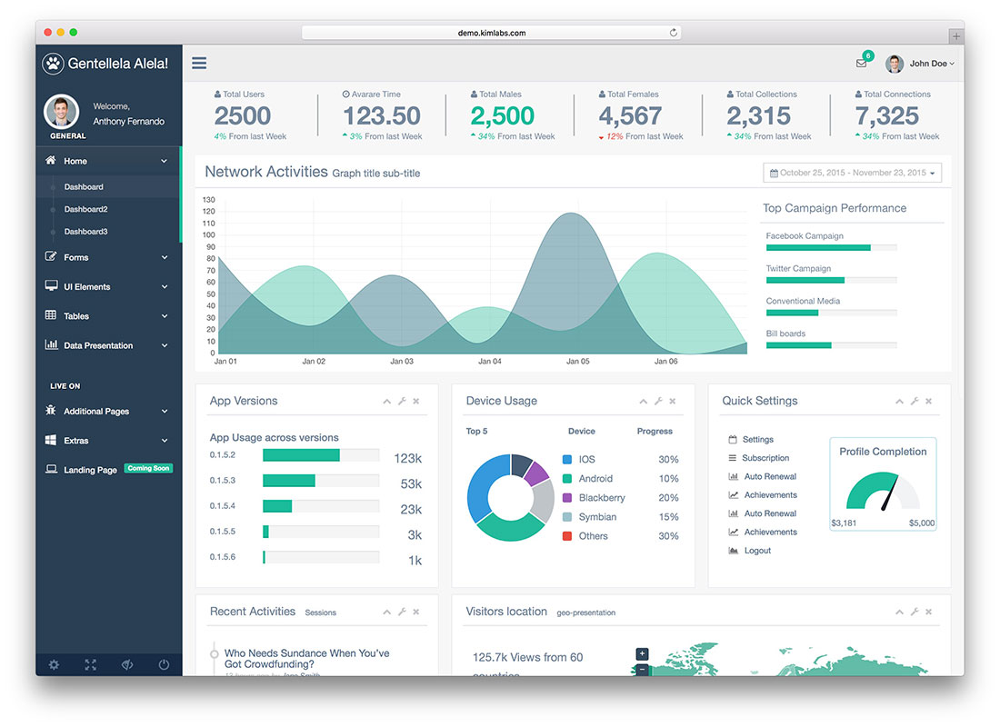

# **Reto UX nº 3 | Creando el sketch de un Dashboard**

------------------------------------------------
------------------------------------------------

## **Objetivo**

El objetivo de este reto es elaborar un sketch de un dashboard para Laboratoria. Un dashboard es una herramienta utilizada por profesores, training managers, directores y gerentes de Laboratoria para ver rápidamente qué está pasando en el salón de clases de Laboratoria. 

## **A tener en cuenta**

- Los elementos de navegación en el sketch.
- Se debe utilizar títulos y textos reales.

- En el dashboard, los usuarios mencionados deben poder ver rápidamente estadísticas y datos en tiempo real como:

- '#'de alumnas inscritas
- '#' de alumnas que desertaron
- '#' y % de alumnas que pasan el criterio mínimo de evaluación
- Promedio de notas por sprint
- Promedio de notas HSE
- Promedio de notas técnicas

- Dado que Laboratoria tiene muchas generaciones, regularmente 2 generaciones por año (estas generaciones empezaron en el 2014), y que opera en 4 sedes (Arequipa, Ciudad de México, Lima y Santiago de Chile), es posible que los usuarios quieran ver datos de sedes / generaciones anteriores para poder hacer comparaciones.

## **Sketch**

- Coloqué está imagen para que puedan verse los datos númericos del gráfico a la izquierda de la zona inferior del dashboard que no se pudieron ver por el flash de la cámara.

- Esto aparece al hacer click al ícono de las tres barras.